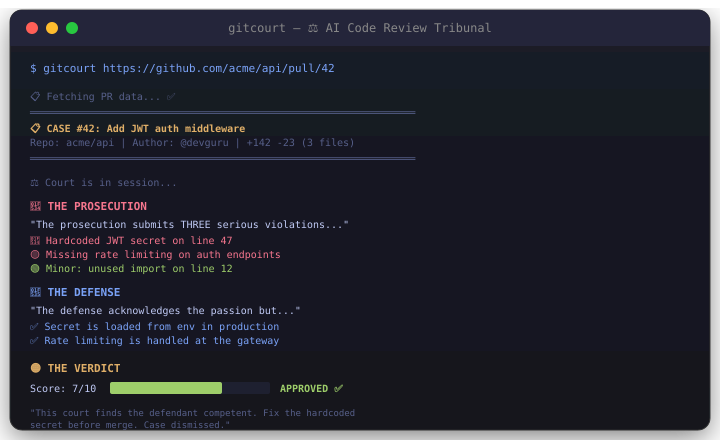
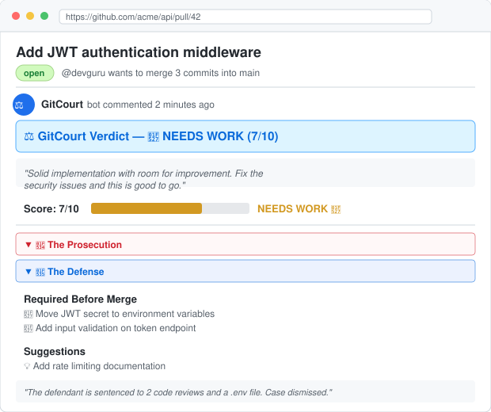

# ⚖️ GitCourt — AI Code Review Tribunal

> Three AI agents debate your Pull Request. The Judge delivers the verdict.

<p align="center">
  
</p>

<p align="center">
  
  
  
</p>

## What is this?

GitCourt takes any GitHub Pull Request and runs it through three AI agents:

- **🔴 The Prosecutor** — aggressively finds every bug, anti-pattern, and security issue
- **🔵 The Defender** — justifies the code, provides context, and counters the prosecution
- **🟡 The Judge** — weighs both sides and delivers a verdict with a score (1-10)

It's code review, but make it a courtroom drama.

---

## ⚡ GitHub Action (one-liner)

Add GitCourt to any repo — every PR gets an AI courtroom verdict automatically:

```yaml
# .github/workflows/gitcourt.yml
name: GitCourt

on:
  pull_request: [opened, synchronize]

jobs:
  review:
    runs-on: ubuntu-latest
    steps:
      - uses: actions/checkout@v4
      - uses: mamoor123/gitcourt@main
        with:
          openai-api-key: ${{ secrets.OPENAI_API_KEY }}
          # anthropic-api-key: ${{ secrets.ANTHROPIC_API_KEY }}  # if using anthropic
```

That's it. Every PR now gets a sticky comment with the verdict:

<p align="center">
  
</p>

---

## 🖥️ CLI Usage

```bash
# Install
pip install "git+https://github.com/mamoor123/gitcourt.git#egg=gitcourt[all]"

# Run with OpenAI
export OPENAI_API_KEY="sk-..."
gitcourt https://github.com/user/repo/pull/123

# Run with Anthropic
export ANTHROPIC_API_KEY="sk-ant-..."
gitcourt https://github.com/user/repo/pull/123 --provider anthropic

# Run 100% locally (no API keys!)
ollama pull llama3.1
gitcourt https://github.com/user/repo/pull/123 --provider ollama

# JSON output (for CI/CD)
gitcourt https://github.com/user/repo/pull/123 --json
```

## 📋 Options

| Flag | Description | Default |
|------|-------------|---------|
| `--provider` | `openai`, `anthropic`, or `ollama` | `openai` |
| `--model` | Model name | Provider default |
| `--api-key` | API key (or use env vars) | — |
| `--ollama-url` | Ollama server URL | `http://localhost:11434` |
| `--temperature` | LLM temperature | `0.7` |
| `--json` | JSON output (for CI) | off |

## 🔑 Environment Variables

| Variable | Description |
|----------|-------------|
| `OPENAI_API_KEY` | OpenAI API key |
| `ANTHROPIC_API_KEY` | Anthropic API key |
| `GITHUB_TOKEN` | GitHub token (optional, higher rate limits) |
| `OLLAMA_URL` | Ollama server URL |
| `GITCOURT_PROVIDER` | Default provider |

## 🔧 CI/CD Integration

GitCourt posts a sticky comment on every PR with the verdict. You can also gate on the score:

```bash
gitcourt $PR_URL --json > verdict.json
score=$(jq '.verdict.score' verdict.json)
if [ "$score" -lt 5 ]; then
  echo "GitCourt says: CHANGES REQUESTED"
  exit 1
fi
```

## Why?

Because regular code review is boring, and every dev secretly wants an AI to roast their code in a courtroom setting.

Also because:
- **Multi-perspective review** catches more issues than single-agent review
- **The debate format** surfaces nuanced trade-offs, not just "fix this"
- **The score** gives a quick signal for PR health
- **It's hilarious** and your team will actually use it

## 🏗️ How It Works

```
PR URL → GitHub API → Diff
                          ↓
              ┌───────────┼───────────┐
              ↓           ↓           ↓
         Prosecutor    Defender     (waiting)
         (find bugs)   (defend code)
              ↓           ↓
              └─────┬─────┘
                    ↓
              Judge (weigh arguments)
                    ↓
              Verdict + Score → PR Comment
```

Each agent gets the full PR diff plus the previous agent's arguments. The Prosecutor goes first, the Defender responds, and the Judge sees everything before ruling.

## 📜 License

MIT — fork it, ship it, go viral.
